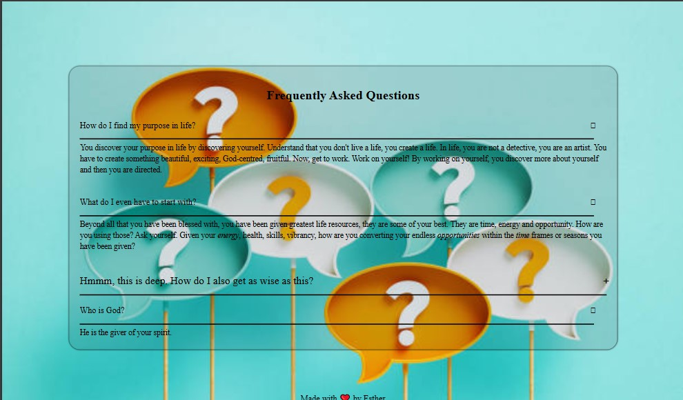

# An accordion that teaches you about the music of life

## Screenshot



### What I learned

I explored more about my love for logic, and I am so much in love with this line.

```js
const answer = this.querySelector(".answer");
```

The 'this' keyword is the specific element that was clicked. That element could be a parent to another. What matters is that it is not index-oriented, it is presence-oriented. It is highly present in this moment, this element. It doesn't borrow from the past. It looks into the future. It looks into what it has. It has two more elements that it carries as children.
And that is where this line comes in...

```js
answer.style.height = answer.scrollHeight + "px";
```

So we want to style each answer's height according to the specific height of the answer, we are simply not hardcoding it this way;

```css
.accordion .content-container.active .answer {
  /* height: 100px; */
  font-size: 15px;
  transition: 0.3s;
  line-height: 1.4;
}
```

We are not giving each answer a hardcoded "100px". In this life, you are not hardcoded. You are unique. Your story. Your path. Your Journey. Your background. Your becoming. You are unique. And the "scrollHeight" property helps us get there. So be future oriented. God has created you and everything that came and will come with your life uniquely for you. And yes! That is what the "scrollHeight" property does. It creates the length of the answer based off of the length it'll demand. You are not behind, but becoming. And what does this create, an accordion with good UX. Orchestrated symphony. Beautiful balance. That is you. That is our world. ❤️
